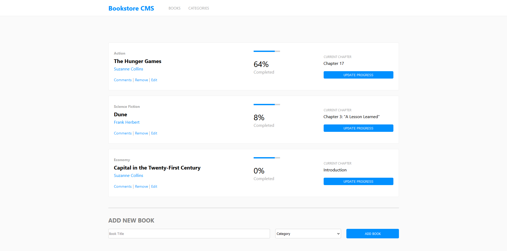

# Bookstore

> Bookstore is a simple React-Redux app that allows you to store information about the books that you have read and save your progress!

## Built With

- Javascript
- React-Redux

<!-- ## Live Demo

[Live Demo Link](https://livedemo.com) -->

## Getting Started

### Install

- `git clone https://github.com/fernandorpm/bookstore.git`
- `cd bookstore`
- `npm install`
- `yarn start`

## Authors

👤 **Fernando R P Marques**

- GitHub: [@fernandorpm](https://github.com/fernandorpm)
- Twitter: [@rpm_fernando](https://twitter.com/rpm_fernando)
- LinkedIn: [Fernando R P Marques](https://linkedin.com/in/fernandorpm)

## 🤝 Contributing

Contributions, issues, and feature requests are welcome!

Feel free to check the [issues page](../../issues/).

## Show your support

Give a ⭐️ if you like this project!
